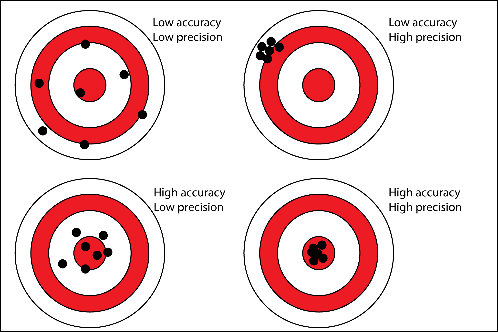
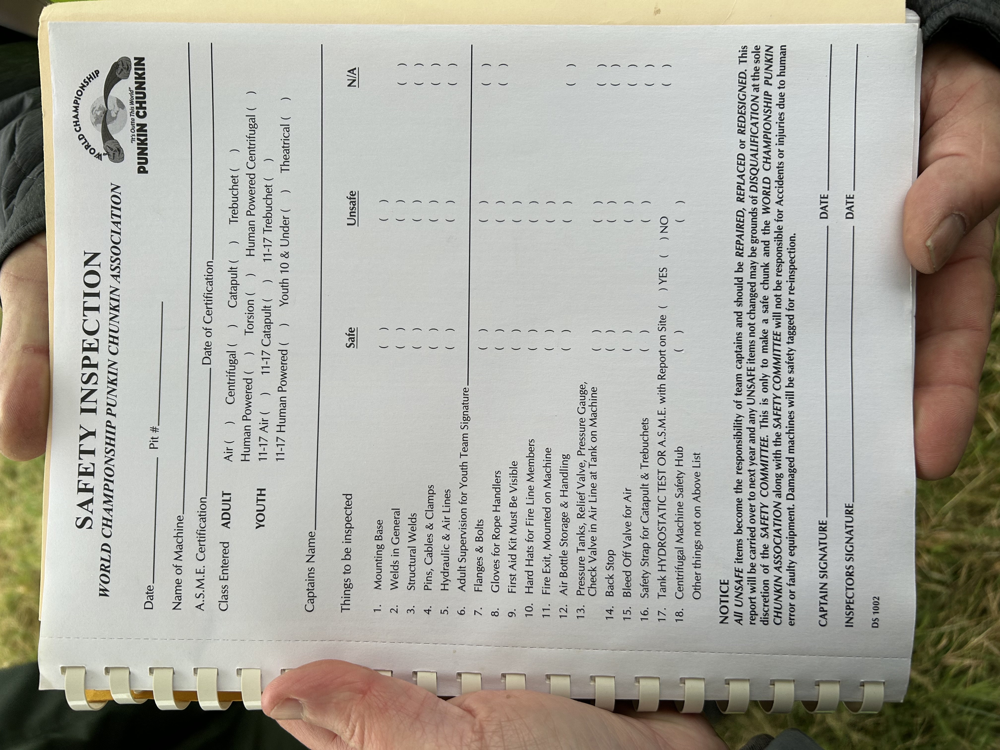
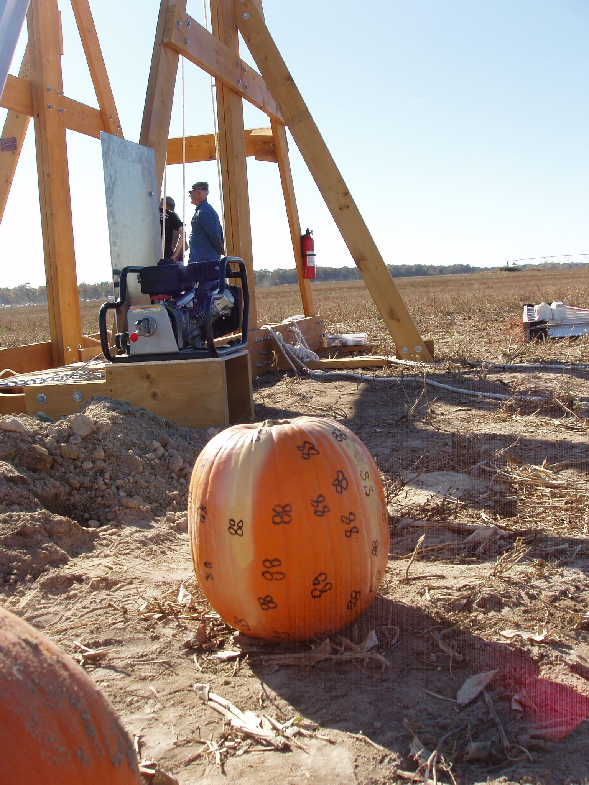
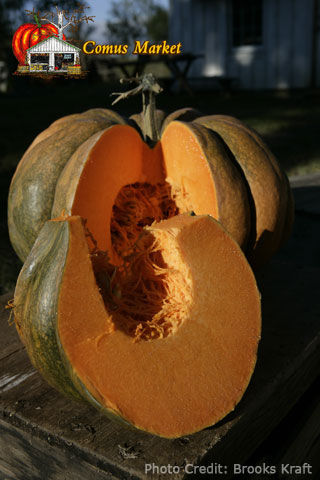

<!--
_class: intro-orange
_header: 
-->

# &nbsp;
# How to Punkin Chunkin

### Presented by: Tommy Falgout 

---

---

# Agenda

- What is "Punkin Chunkin"?
- Chunker styles
- Safety
- Physics
- Get started!
- Q&A

---

# Me

- Big maker nerd
  - LEGO Robo-Clippy, Bad AI In A Box, LED Lanyard
- Partner Solution Architect @ Microsoft (ex-Yahoo!, ex-Nortel)
- [Trebuchet expert for Dude Perfect](https://www.imdb.com/name/nm9305352/) (S2.E6)
- Organizer of "SlingFest"
- Competed Punkin Chunkin

<!--
_footer: Source: me
-->
---

# Address the Oliphaunt in the room

- Some people get siege weaponry information from social media

<!--
_footer: Source: Myself and [Know your meme](https://knowyourmeme.com/editorials/collections/15-trebuchet-memes-proving-catapults-are-the-inferior-siege-engine)
-->
---

# Vocabulary

From Wikipedia:
* [Catapult](https://en.wikipedia.org/wiki/Catapult) - a ballistic device used to launch a projectile a great distance without the aid of gunpowder or other propellants
* [Trebuchet](https://en.wikipedia.org/wiki/Trebuchet) - uses a rotating arm with a sling attached to the tip to launch a projectile
* A trebuchet is a type of catapult
  - e.g. All squares are rectangles, but not all rectangles are squares

---

# Vocabulary

- Accuracy - ability to hit the intended target
- Precision - ability to hit same spot

---

# History - Punkin Chunkin

- Annual event since 1985
- Organized by "World Championship Punkin Chunkin Association (WCPCA)"
- Cancelled and restarted multiple times due to injuries, legal and logistics issues
- 2023 was in Vinita, Oklahoma

---

# History - Slingfest

- Annual event from 2011 - 2016 in DFW
- Last event had 1000+ attendees
- Local news coverage

[Slingfest in Plano, TX](https://www.youtube.com/watch?v=kacsOd8f__Q)

<!--
_footer: Photo source: [Plano Magazine - 5th Annual SlingFest](https://planomagazine.com/5th-annual-slingfest/)
-->

---

<!--
_class: intro-orange
_footer: NOTE: Listed in order of scariness to me
-->

# Punkin Chunkin' Categories

- Air cannon
- Centrifugal
- Torsion
- Catapult
- Trebuchet

---

# Air Cannon

If you ever built a potato gun or at least had the opportunity to shoot one, Air Cannons at the annual Punkin Chunkin are the big daddy of potato guns. Using compressed air, nothing flamable, these machines shoot pumpkins over 4,000 feet

[University of Delaware video example](https://www.youtube.com/watch?v=GnGkNmgx4ik)

<!--
_footer: Photo source: [USA Today](https://www.usatoday.com/story/life/tv/2016/11/20/punkin-chunkin-program-canceled-after-accident/94162012/)
-->

---

# Centrifugal

These machines build up inertia in an circular motion and have ways to release the pumpkin at the optimal trajectory for an outstanding distance shot.

NOTE: Centrifugal force is a fictitious force and is actually an "inertial force".

[Bad to the Bone video example](https://www.youtube.com/watch?app=desktop&v=CoN7JMa0qyc)

<!--
_footer: Photo source: [Wired - More Punkin Chunkin Centrifugal Machine](https://www.wired.com/2009/11/more-punkin-chunkin-centrifugal-machine/)
-->

---

# Torsion (e.g. Onager)

A Torsion machine is any device that uses twisted rope as its primary source of power. It relies on a rope that works by torsion or twisting. The rope stores mechanical energy when it is twisted. The amount of force it releases is proportional to the amount it is twisted.

<!--
_footer: Photo source: [Storm the Castle - A Timeline of Development of the Catapult](https://www.stormthecastle.com/catapult/development-timeline-of-the-catapult.htm)
-->

---

# Trebuchet - History

French for "overturn".

Earliest ones seen in China ~4th century BC (powered by men on ropes: traction trebuchet).  Counterweight replaced people ~12th century.

<!--
_footer: Photo source: [Wikipedia - Trebuchet](https://en.wikipedia.org/wiki/Trebuchet)
-->

---

# Trebuchet

Modern trebuchets are powered by gravity, and use a counterweight attached to an arm to swing the ballistic attached to a sling around and release at an optimal angle.

[Trebuchet video example](https://www.youtube.com/watch?v=hZxCEkGk6HI)

<!--
_footer: Photo source: [Mikora - Diagram Of A Trebuchet](https://www.mikrora.com/diagram-of-a-trebuchet/)
-->

---

<!--
_class: intro-orange
_footer: NOTE: Listed in order of difficulty
-->

# Trebuchet types

- Fixed counterweight
- Hinged counterweight
- Floating Arm
- MURLIN
- Human powered
- And many more

---

# Fixed Counterweight Trebuchet

- Weight is attached directly to the arm
- Weight drops in an arc

<!--
_footer: Photo source: [Design and Technology Online - Trebuchet](https://wiki.dtonline.org/index.php/Trebuchet)
-->

---

# Hinged Counterweight Trebuchet (traditional)

- Weight is atached to a pivot point on the arm
- This enabled a better "drop" of the weight
- Frame on wheels helps ensure more force is delivered to ballistic
- OG Hurler.  All other designs are modern inventions

<!--
_footer: Photo source: [Real World Physics Problems - Catapult physics](https://www.real-world-physics-problems.com/catapult-physics.html)
-->

---

# Floating Arm Trebuchet

[Example - Slingfest](https://photos.app.goo.gl/f9g5QM2VqQ5A7ZXR7)
[Example - Slingfest](https://photos.app.goo.gl/zzQ5DJsekhk6tquq6)

Credit: [LanceMakes @ Instructrables](https://www.instructables.com/The-Floating-Arm-Trebuchet/)

<!--
_footer: Photo source: [Instructables - Floating Arm Trebuchet](https://www.instructables.com/The-Floating-Arm-Trebuchet/)
-->

---

# MURLIN

[Example - Slingfest](https://photos.app.goo.gl/AvXtbn28Q5Wgi4Gs9)
[Example - Test shot](https://photos.app.goo.gl/56E4Ru8NKCEAUznK7)

<!--
_footer: Photo source: [Youtube - Popsicle Stick Murlin Trebuchet](https://www.youtube.com/watch?v=XzT6rA56Ydg)
-->

---

# Walking Arm

A fun, simple, weekend project to toss tennis balls.

<!--
_footer: Source: [Instructables - Walking Arm Trebuchet](https://www.instructables.com/Worlds-Simplest-and-Newest-Trebuchet-Walking-Arm-T/)
-->

---

# Human Powered

Machines can use any kind of stored energy that can be stored by a single person in two minutes.

[Hamster wheel example](https://www.youtube.com/watch?v=7X4v9lFgppA)

<!--
_footer: Photo source: [Snapshots and sojourns - Punkin Chunkin 2013](https://snapshotsandsojourns.com/2013/11/06/punkin-chunkin-2013/)
-->

---

# Colossal Thunder

- Built by Corey Winesburg + his welding students in OK
- Won Punkin Chunkin student division + Adult Trebuchet record holder (3377 feet, 2019)
- Split counterweight

[Example](https://www.youtube.com/watch?v=5WxPoU7sf9E)
[OK TV](https://www.youtube.com/watch?v=7uc2JgNQN0o)

<!--
_footer: Photo source: me at Punkin Chunkin
-->

---

# Safety

- "Hourglass of Danger"
  - e.g. danger zones of a horse
- Invest in good firing mechanisms
  - e.g. snap shackles
- Treat loaded like loaded gun
- Pre-flight checks
- AVOID DRY FIRING (Like a bow and arrow)
- Check structrual integrity after each launch

[Safety example](https://photos.app.goo.gl/e4ge751RjLEJye6G9)

<!--
_footer: Photo source: [Plano Magazine - 5th Annual SlingFest](https://planomagazine.com/5th-annual-slingfest/)
-->

---

# Pre-Flight Checks

Example:
- Safety on
- Ballistic loaded properly
- No twisted or obstructed rope
- Range is clear
- Nothing valuable in "cone of danger"

<!--
_footer: Photo source: me at Punkin Chunkin 2023
-->
---

# Physics

- Guinness world record: pneumatic cannon at 5,500+ feet
- Pie-ing a pumpkin (i.e. "pumpkin pie in the sky")

---

# Pumpkins

- For large chunkers, structural integrity is important
  -  e.g. Chunk Norris sorted 5000+ pumpkins and brought ~50
- Popular varities: La Estrella, Calabasa Verde, Fairytale
- [WCPCA weight ranges rules](cache/World-Championship-Punkin-Chunkin-Rules.pdf):
  - Adult Classes: 8-10 lbs.
  - 11-17 Classes: 4-10 lbs.
  - 10 & Under Classes: 2-4 lbs.

<!--
_footer: Photo source: [Team War Hammer at the 2008 WCPCA](https://www.facebook.com/photo.php?fbid=8342488389129005&set=p.8342488389129005&type=3) + Brooks Kraft
-->

---

# Factors in building

- Release Angle
- Rope will stretch
- Distance of axle to counterweight and sling
- Length of sling
- Materials used
- Weather

---

# How/where do I get started?

- Pick a design
  - Recommendation: Hinged counterweight (10 lbs)
- Start small
  - Recommendation: Baseball (5 oz) or Tennis ball (2 oz)
- Experiment + Learn
  - Recommendation: Outside (200 feet)
- Go bigger
  - Recommendation: Safety

<!--
_footer: Photo source: [Maker Badge](https://lastcoolnameleft.github.io/maker-badges/). After you build your first trebuchet, get your badge here!
-->
---

# Skills

- Basic woodworking
  - Measure, cut, join
- Knots
  - Knot 3D app
- Basic math
  - [Find midpoints](https://www.youtube.com/watch?v=IyBtAnsP1p4), [calculate angles](https://www.youtube.com/watch?v=PQgcLbeZ8xs)
- Project planning
  - Kanban board
- First Aid

---

# Tools & Materials

- Saws (hand, circular, compound miter, table)
- Speed square
- Digital angle finder
- Levels
- Clamps (SO MANY CLAMPS)
- Drills (standard, impact)
- Markers (carpenter pencils)
- Workbench (Simpson strong-tie)
- Marine tools (quick release snap shackle, marine rope)
- Digital angle finder
- Local Makerspace

<!--
_footer: Photo source: [Wikipedia - Ænima](https://en.wikipedia.org/wiki/%C3%86nima)
-->

---

# Lumber

- Get started with Common boards (e.g. pine) from Home Depot / Lowes
  - Don't get treated wood (nasty chemicals)
- Listed in depth and width (e.g. 1x3, 2x4, etc.)
- Board is cut THEN planed (straight-ish)
  - e.g. 2x4 is NOT 2"x4".
    - Actually about 1.5" x 3.5"
  - e.g. 1x4 is .75" x 3.5"
- [Pilot holes](https://en.wikipedia.org/wiki/Pilot_hole) are your friend

<!--
_footer: Photo source: [Cyanide & Happiness](https://explosm.net/)
-->

---

# Pro Tips

Think in terms of a constructing a vessel and label pieces accordingly

- Foreward = where the ballistic is directed towards
- Stern / Aft = backside, opposite of foreward
- Port = When facing forward, on the left
- Starboard = When facing forward, on the right

<!--
_footer: Photo source: [Marine Insight - What is Flotsam and Jetsam in Shipping?](https://www.marineinsight.com/marine-navigation/nautical-terms-meaning-of-flotsam-and-jetsam-in-shipping/)
-->
---

# Ready to build?

- [Reddit - /r/trebuchet](https://www.reddit.com/r/Trebuchet/)
- [Reddit - /r/PunkinChunkers](https://www.reddit.com/r/PunkinChunkers/)
- [Facebook - Texas Trebuchet](https://www.facebook.com/groups/404259739587758)
- Your local makerspace
- [Pumpkin Chunkin Events and Festivals](https://pumpkinpatchesandmore.org/pumpkinchunkin.php)
- Nov 29th in Lewisville!

---

# FAQ

- How big should I make my arm/sling/counterweight/etc.?
  - [Virtual Trebuchet](https://virtualtrebuchet.com/)
- How many people should I have on my team?
  - [Two Pizza Team Rule](https://martinfowler.com/bliki/TwoPizzaTeam.html)
- Can my ballistic be too light?
  - Yup!  Foam doesn't launch as nicely as tennis ball
- Can my ballistic be too heavy?
  - Depends on your objective...

---

# Q&A

---

# Slides available at:

[https://lastcoolnameleft.github.io/how-to-punkin-chunkin/](https://lastcoolnameleft.github.io/how-to-punkin-chunkin/)

