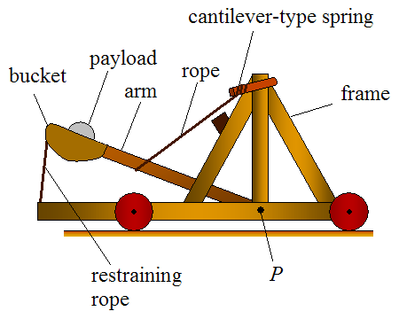

<!--
_class: intro-orange
_header: 
-->

# &nbsp;
# How to Punkin Chunkin

### Presented by: Tommy Falgout 

---

# Agenda

- What is "Punkin Chunkin"?
- Chunker styles
- Physics
- Safety
- Get started!
- Q&A

---

# Me

- Partner Solution Architect @ Microsoft (ex-Yahoo!, ex-Nortel)
- Trebuchet expert for Dude Perfect episode 
- Organizer of "SlingFest"
- Competed in multiple Punkin Chunkin's

---

---

# History - Punkin Chunkin

- Annual event from 1985 to 2013 in Delaware
- Organized by "World Championship Punkin Chunkin Association (WCPCA)"
- Cancelled multiple times due to injuries, legal and logistics issues
- Restarted in 2023 in Vinita, Oklahoma

---

# History - Slingfest

- Annual event from 2011 - 2016 in DFW
- Last event had 1000+ attendees
- Local news coverage

[Slingfest in Plano](https://www.youtube.com/watch?v=kacsOd8f__Q)

---

<!--
_class: intro-orange
-->

# Punkin Chunkin' Categories

- Air cannon
- Catapult
- Torsion
- Centrifugal
- Trebuchet

---

# Air Cannon

If you ever built a potato gun or at least had the opportunity to shoot one, Air Cannons at the annual Punkin Chunkin are the big daddy of potato guns. Using compressed air, nothing flamable, these machines shoot pumpkins over 4,000 feet

[University of Delaware Video example](https://www.youtube.com/watch?v=GnGkNmgx4ik)

---

# Catapult

Similar to a Trebuchet in terms of an arm swinging a pumpkin around attached to a sling, with the exception that these machines are normally powered by springs or rubber bands

---

# Torsion

A Torsion machine is any device that uses twisted rope as its primary source of power. It relies on a rope that works by torsion or twisting. The rope stores mechanical energy when it is twisted. The amount of force it releases is proportional to the amount it is twisted.

---

# Centrifugal

These machines build up centrifugal force in an circular motion and have ways to release the pumpkin at the optimal trajectory for an outstanding distance shot.

[Bad to the Bone video example](https://www.youtube.com/watch?app=desktop&v=CoN7JMa0qyc)
[Bad to the Bone video example 2](https://www.youtube.com/watch?app=desktop&v=MTWsmZta6AE)

---

# Trebuchet

Powered exclusively by gravity, these machines use a counterweight attached to an arm to swing the pumpkin attached to a sling around and release at an optimal pin angle.

[Hurl a piano example](https://www.youtube.com/watch?v=hZxCEkGk6HI)

---

<!--
_class: intro-orange
-->

# Trebuchet types

- Fixed counterweight
- Hinged counterweight
- Floating Arm
- MURLIN
- Human powered
- And many more

---

# Fixed Counterweight Trebuchet

Credit: [D&T Online](https://wiki.dtonline.org/index.php/Trebuchet)

---

# Hinged Counterweight Trebuchet (traditional)

Credit: [D&T Online](https://www.real-world-physics-problems.com/trebuchet-physics.html)

---

# Floating Arm Trebuchet

[Example - Slingfest](https://photos.app.goo.gl/f9g5QM2VqQ5A7ZXR7)
[Example - Slingfest](https://photos.app.goo.gl/zzQ5DJsekhk6tquq6)

Credit: [LanceMakes @ Instructrables](https://www.instructables.com/The-Floating-Arm-Trebuchet/)

---

# MURLIN

[Example - Slingfest](https://photos.app.goo.gl/AvXtbn28Q5Wgi4Gs9)
[Example - Test shot](https://photos.app.goo.gl/56E4Ru8NKCEAUznK7)

---

# Human Powered

Machines can use any kind of stored energy that can be stored by a single person in two minutes.

[Hamster wheel example](https://www.youtube.com/watch?v=7X4v9lFgppA)

---

# Colossal Thunder

- Built by Corey Winesburg + his welding students in OK
- Won Punkin Chunkin student division + Adult Trebuchet record holder (3377 feet, 2019)
- Split counterweight

[Example](https://www.youtube.com/watch?v=5WxPoU7sf9E)
[OK TV](https://www.youtube.com/watch?v=7uc2JgNQN0o)

---

# Physics

- Guinness world record: pneumatic cannon at 5,500+ feet
- Pie-ing a pumpkin (i.e. "pumpkin pie in the sky")

---

# Safety

- "Cone of Danger"
- "If a pumpkin weighing 5 pounds were to be thrown at someone at a velocity of 10 meters per second, it could potentially cause injury upon impact." (Credit ChatGPT)

[Safety example](https://photos.app.goo.gl/e4ge751RjLEJye6G9)

---

# Factors in building

- Mass of counterweight
- Mass of ballistics
- Drop distance
- Release Angle
- And so much more...

---

# How/where do I get started?

* Pick a design
  - Recommendation: Hinged counterweight (10 lbs)
* Start small
  - Recommendation: Baseball (5 oz)
* Experiment + Learn
  - Recommendation: Outside (200 feet)
* Go bigger
  - Recommendation: Safety
  
---

# FAQ

- How big should I make my arm/sling/counterweight/etc.?
  - [Virtual Trebuchet](https://virtualtrebuchet.com/)

---

# Q&A

---

# Extra Reading

- https://classes.engineering.wustl.edu/2009/fall/ese251/presentations/%28AAM_13%29Trebuchet.pdf