<!--
_class: intro-orange
_header: 
-->

# &nbsp;
# How to Punkin Chunkin

### Presented by: Tommy Falgout 

---

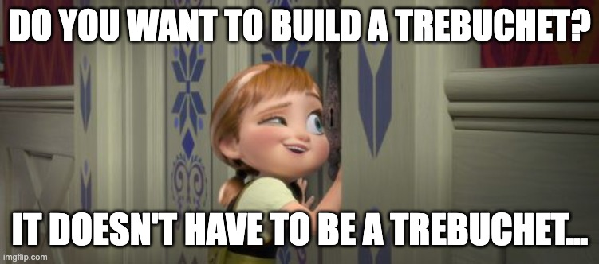

---

# Agenda

- What is "Punkin Chunkin"?
- Chunker styles
- Safety
- Physics
- Get started!
- Q&A

---

# Me

- Big maker nerd
  - LEGO Robo-Clippy, Bad AI In A Box, LED Lanyard
- Partner Solution Architect @ Microsoft (ex-Yahoo!, ex-Nortel)
- [Trebuchet expert for Dude Perfect](https://www.imdb.com/name/nm9305352/) (S2.E6)
- Organizer of "SlingFest"
- Competed Punkin Chunkin

<!--
_footer: Source: me
-->
---

# Address the Oliphaunt in the room

- Some people get siege weaponry information from social media

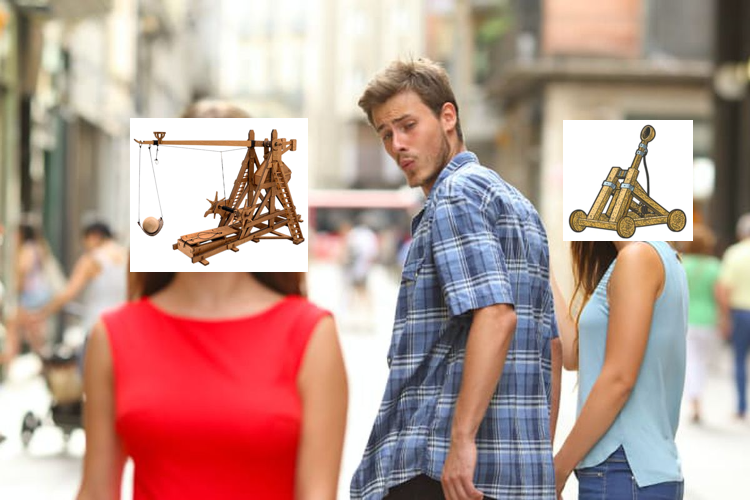
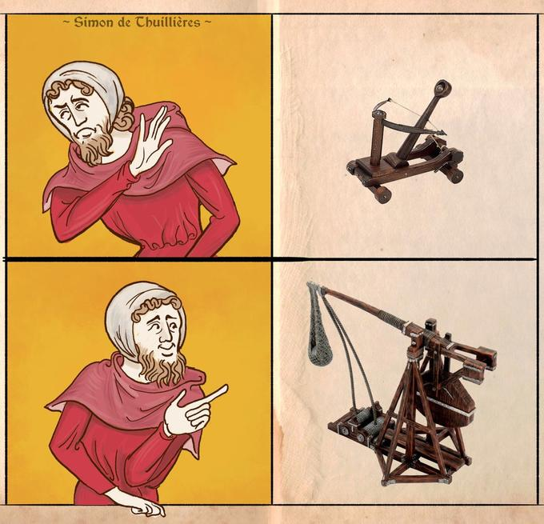

<!--
_footer: Source: [Know your meme](https://knowyourmeme.com/editorials/collections/15-trebuchet-memes-proving-catapults-are-the-inferior-siege-engine)
-->
---

# Terminology

From Wikipedia:
* [Catapult](https://en.wikipedia.org/wiki/Catapult) - a ballistic device used to launch a projectile a great distance without the aid of gunpowder or other propellants
* [Trebuchet](https://en.wikipedia.org/wiki/Trebuchet) - uses a rotating arm with a sling attached to the tip to launch a projectile
* Ergo: a trebuchet is a type of catapult

---

# History - Punkin Chunkin

- Annual event from 1985 to 2013 in Delaware
- Organized by "World Championship Punkin Chunkin Association (WCPCA)"
- Cancelled and restarted multiple times due to injuries, legal and logistics issues
- Last year was in Vinita, Oklahoma

---

# History - Slingfest

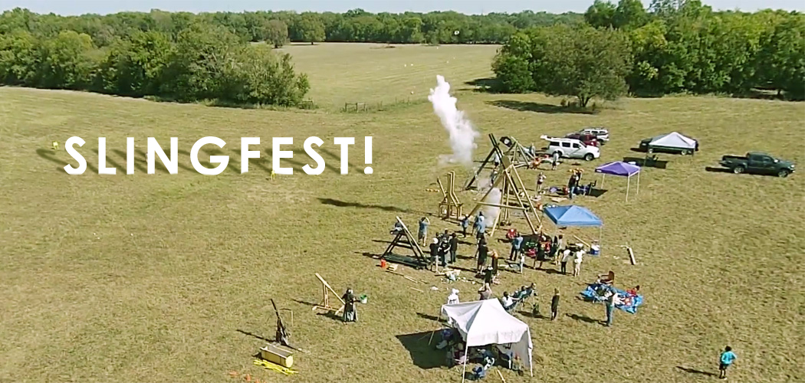

- Annual event from 2011 - 2016 in DFW
- Last event had 1000+ attendees
- Local news coverage

[Slingfest in Plano](https://www.youtube.com/watch?v=kacsOd8f__Q)

<!--
_footer: Source: [Plano Magazine - 5th Annual SlingFest](https://planomagazine.com/5th-annual-slingfest/)
-->

---

<!--
_class: intro-orange
_footer: NOTE: Listed in order of scariness to me
-->

# Punkin Chunkin' Categories

- Air cannon
- Centrifugal
- Torsion
- Catapult
- Trebuchet

---

# Air Cannon

If you ever built a potato gun or at least had the opportunity to shoot one, Air Cannons at the annual Punkin Chunkin are the big daddy of potato guns. Using compressed air, nothing flamable, these machines shoot pumpkins over 4,000 feet

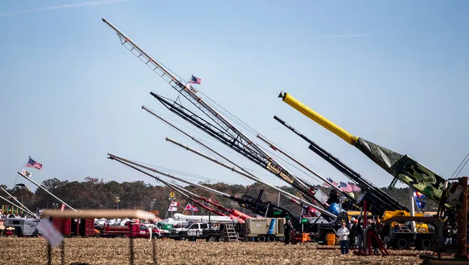

[University of Delaware video example](https://www.youtube.com/watch?v=GnGkNmgx4ik)

<!--
_footer: Source: [USA Today](https://www.usatoday.com/story/life/tv/2016/11/20/punkin-chunkin-program-canceled-after-accident/94162012/)
-->

---

# Centrifugal

These machines build up centrifugal force in an circular motion and have ways to release the pumpkin at the optimal trajectory for an outstanding distance shot.

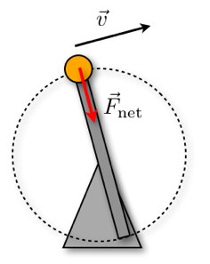

[Bad to the Bone video example](https://www.youtube.com/watch?app=desktop&v=CoN7JMa0qyc)

<!--
_footer: Source: [Wired - More Punkin Chunkin Centrifugal Machine](https://www.wired.com/2009/11/more-punkin-chunkin-centrifugal-machine/)
-->

---

# Torsion (e.g. Onager)

A Torsion machine is any device that uses twisted rope as its primary source of power. It relies on a rope that works by torsion or twisting. The rope stores mechanical energy when it is twisted. The amount of force it releases is proportional to the amount it is twisted.

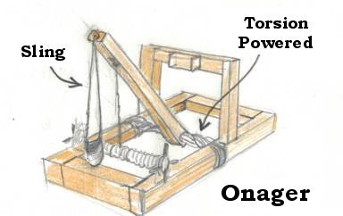

<!--
_footer: Source: [Storm the Castle - A Timeline of Development of the Catapult](https://www.stormthecastle.com/catapult/development-timeline-of-the-catapult.htm)
-->

---

# Trebuchet - History

French for "overturn".

Earliest ones seen in China ~4th century BC (powered by men on ropes: traction trebuchet).  Counterweight replaced people ~12th century.

<!--
_footer: Source: [Wikipedia - Trebuchet](https://en.wikipedia.org/wiki/Trebuchet)
-->

---

# Trebuchet

Modern trebuchets are powered by gravity, and use a counterweight attached to an arm to swing the ballistic attached to a sling around and release at an optimal angle.

[Trebuchet video example](https://www.youtube.com/watch?v=hZxCEkGk6HI)

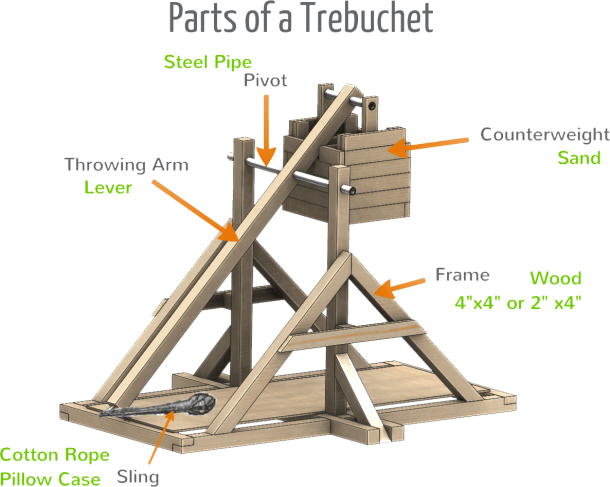

<!--
_footer: Source: [Mikora - Diagram Of A Trebuchet](https://www.mikrora.com/diagram-of-a-trebuchet/)
-->

---

<!--
_class: intro-orange
_footer: NOTE: Listed in order of difficulty
-->

# Trebuchet types

- Fixed counterweight
- Hinged counterweight
- Floating Arm
- MURLIN
- Human powered
- And many more

---

# Fixed Counterweight Trebuchet

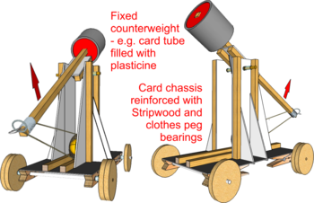

* Weight is attached directly to the arm
* Weight drops in an arc

<!--
_footer: Source: [Design and Technology Online - Trebuchet](https://wiki.dtonline.org/index.php/Trebuchet)
-->

---

# Hinged Counterweight Trebuchet (traditional)

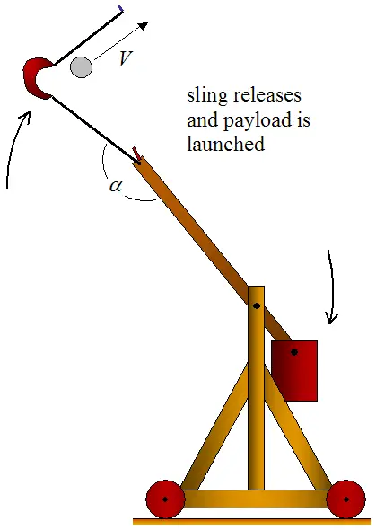

* Weight is atached to a pivot point on the arm
* This enabled a better "drop" of the weight
* Frame on wheels helps ensure more force is delivered to ballistic

<!--
_footer: Source: [Real World Physics Problems - Catapult physics](https://www.real-world-physics-problems.com/catapult-physics.html)
-->

---

# Floating Arm Trebuchet

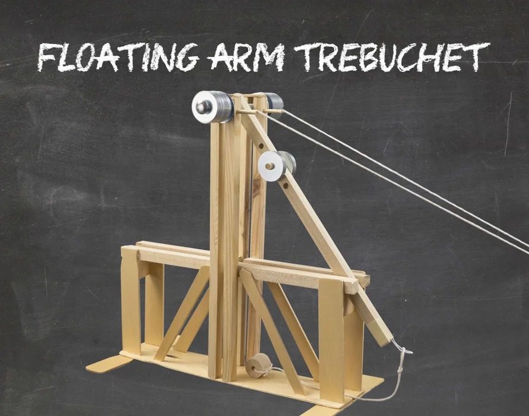

[Example - Slingfest](https://photos.app.goo.gl/f9g5QM2VqQ5A7ZXR7)
[Example - Slingfest](https://photos.app.goo.gl/zzQ5DJsekhk6tquq6)

Credit: [LanceMakes @ Instructrables](https://www.instructables.com/The-Floating-Arm-Trebuchet/)

<!--
_footer: Source: [Instructables - Floating Arm Trebuchet](https://www.instructables.com/The-Floating-Arm-Trebuchet/)
-->

---

# MURLIN

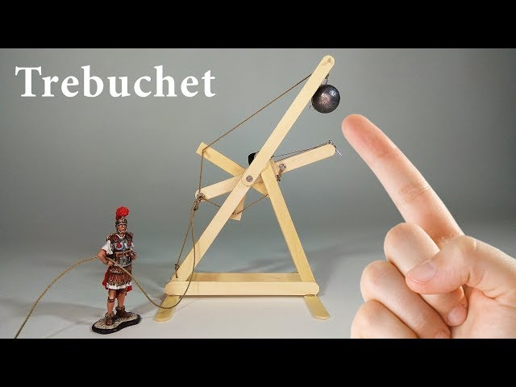

[Example - Slingfest](https://photos.app.goo.gl/AvXtbn28Q5Wgi4Gs9)
[Example - Test shot](https://photos.app.goo.gl/56E4Ru8NKCEAUznK7)

<!--
_footer: Source: [Youtube - Popsicle Stick Murlin Trebuchet](https://www.youtube.com/watch?v=XzT6rA56Ydg)
-->

---

# Walking Arm

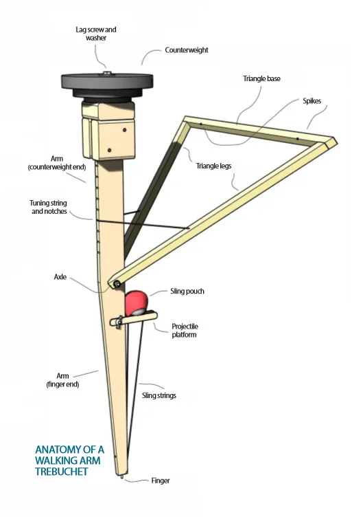

A fun, simple, weekend project to toss tennis balls.

<!--
_footer: Source: [Instructables - Walking Arm Trebuchet](https://www.instructables.com/Worlds-Simplest-and-Newest-Trebuchet-Walking-Arm-T/)
-->

---

# Human Powered

Machines can use any kind of stored energy that can be stored by a single person in two minutes.

[Hamster wheel example](https://www.youtube.com/watch?v=7X4v9lFgppA)

<!--
_footer: Source: [Snapshots and sojourns - Punkin Chunkin 2013](https://snapshotsandsojourns.com/2013/11/06/punkin-chunkin-2013/)
-->

---

# Colossal Thunder

- Built by Corey Winesburg + his welding students in OK
- Won Punkin Chunkin student division + Adult Trebuchet record holder (3377 feet, 2019)
- Split counterweight

[Example](https://www.youtube.com/watch?v=5WxPoU7sf9E)
[OK TV](https://www.youtube.com/watch?v=7uc2JgNQN0o)

<!--
_footer: Source: me
-->

---

# Safety

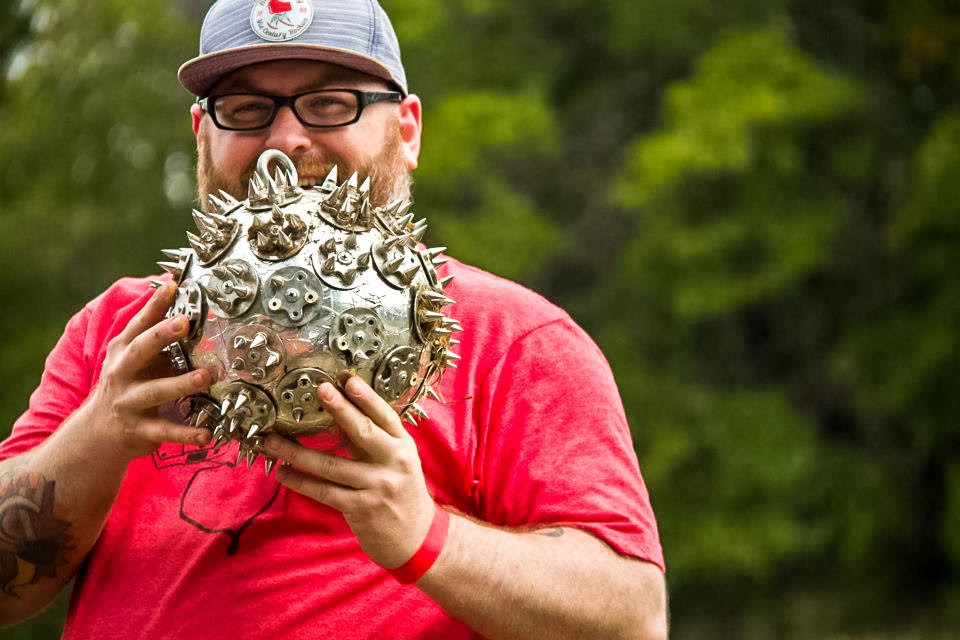

- "Cone of Danger"
  - Similar danger zones of a horse
- "If a pumpkin weighing 5 pounds were to be thrown at someone at a velocity of 10 meters per second, it could potentially cause injury upon impact." (Credit ChatGPT)

[Safety example](https://photos.app.goo.gl/e4ge751RjLEJye6G9)

<!--
_footer: Source: [Plano Magazine - 5th Annual SlingFest](https://planomagazine.com/5th-annual-slingfest/)
-->

---

# Physics

- Guinness world record: pneumatic cannon at 5,500+ feet
- Pie-ing a pumpkin (i.e. "pumpkin pie in the sky")

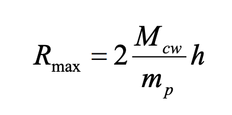

---

# Factors in building

- Mass of counterweight
- Mass of ballistics
- Drop distance
- Release Angle
- And so much more...

---

# How/where do I get started?

- Pick a design
  - Recommendation: Hinged counterweight (10 lbs)
- Start small
  - Recommendation: Baseball (5 oz)
- Experiment + Learn
  - Recommendation: Outside (200 feet)
- Go bigger
  - Recommendation: Safety

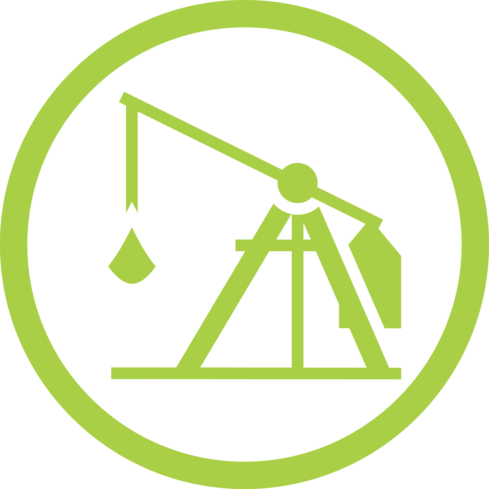

<!--
_footer: Source: [Maker Badge](https://lastcoolnameleft.github.io/maker-badges/). After you build your first trebuchet, get your badge here!
-->
---

# Skills

- Basic woodworking
  - Measure, cut, join
- Knots
  - Knot 3D app
- Basic math
  - Find midpoints
- Project planning
  - Kanban board

---

# Lumber

- Get started with Common boards (e.g. pine) from Home Depot / Lowes
  - Don't get treated wood (arsenic)
- Listed in depth and width (e.g. 1x3, 2x4, 1x8, etc.)
- Board is cut THEN planed (to make straight-ish)
  - e.g. 2x4 is NOT 2"x4".  Actually about 1.5" x 3.5"
  - e.g. 1x4 is .75" x 3.5"
- Pilot holes are your friend

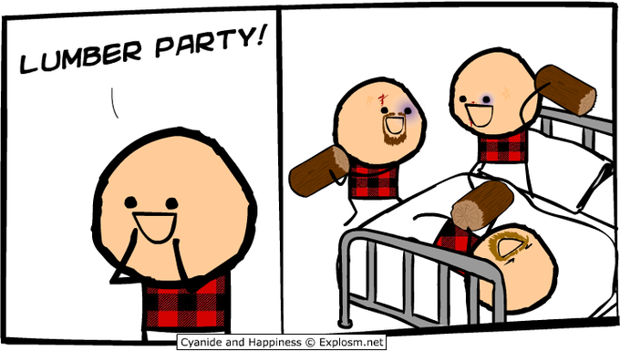

<!--
_footer: Source: [Cyanide & Happiness](https://explosm.net/)
-->

---

# Tools

- Saws (hand, circular, compound miter, table)
- Levels
- Clamps (SO MANY CLAMPS)
- Drills (standard, impact)
- Markers (carpenter pencils)
- Workbench (Simpson strong-tie)

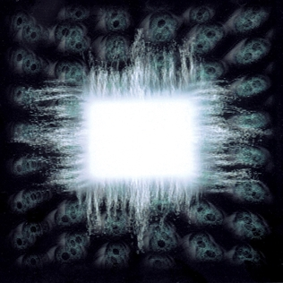

<!--
_footer: Source: [Wikipedia - Ænima](https://en.wikipedia.org/wiki/%C3%86nima)
-->

---

# Pro Tips

Think in terms of a constructing a vessel and label pieces accordingly

- Foreward = where the ballistic is directed towards
- Stern / Aft = backside, opposite of foreward
- Port = When facing forward, on the left
- Starbord = When facing forward, on the right

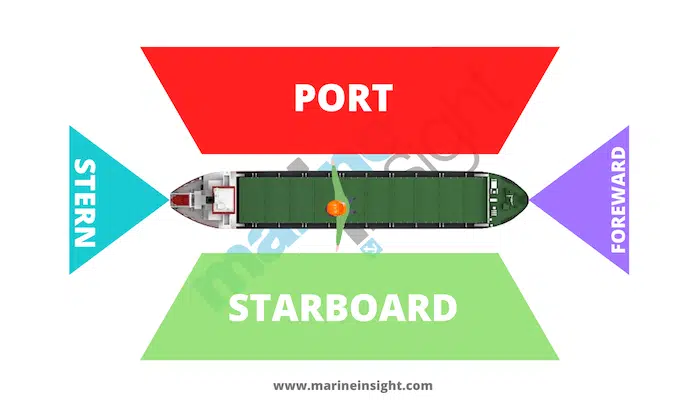

<!--
_footer: Source: [Marine Insight - What is Flotsam and Jetsam in Shipping?](https://www.marineinsight.com/marine-navigation/nautical-terms-meaning-of-flotsam-and-jetsam-in-shipping/)
-->
---

# FAQ

- How big should I make my arm/sling/counterweight/etc.?
  - [Virtual Trebuchet](https://virtualtrebuchet.com/)

---

# Q&A

---

# Extra Reading

- https://classes.engineering.wustl.edu/2009/fall/ese251/presentations/%28AAM_13%29Trebuchet.pdf
- https://tuhsphysics.ttsd.k12.or.us/Research/IB09/FarrCars/index.htm#source3
